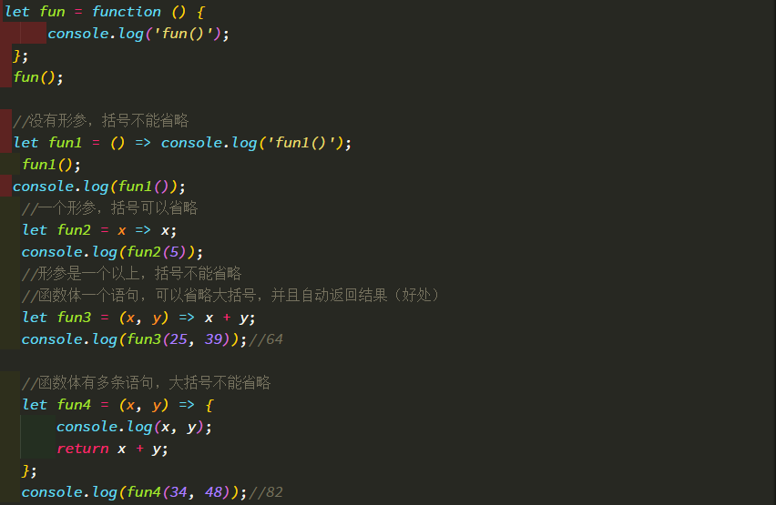
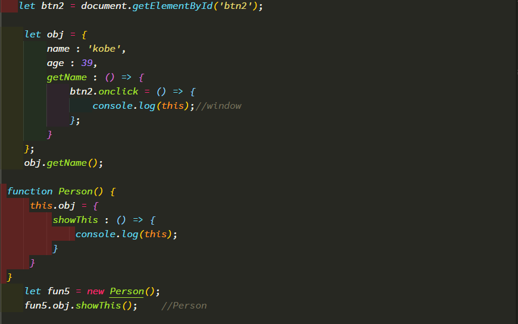

* 作用: 定义匿名函数
* 基本语法:
  * 没有参数: () => console.log('xxxx')
  * 一个参数: i => i+2
  * 大于一个参数: (i,j) => i+j
  * 函数体不用大括号: 默认返回结果
  * 函数体如果有多个语句, 需要用{}包围，若有需要返回的内容，需要手动返回
* 使用场景: 多用来定义回调函数

* 箭头函数的特点：
    1. 简洁
    2. 箭头函数没有自己的this，箭头函数的this不是调用的时候决定的，而是在定义的时候处在的对象就是它的this
    3. 扩展理解： 箭头函数的this看外层的是否有函数，
        如果有，外层函数的this就是内部箭头函数的this，
        如果没有，则this是window。
        
        
  箭头函数的表达形式：
  

  箭头函数没有自己的this
  
  
     
      
        
        