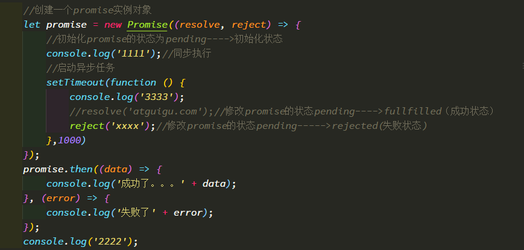
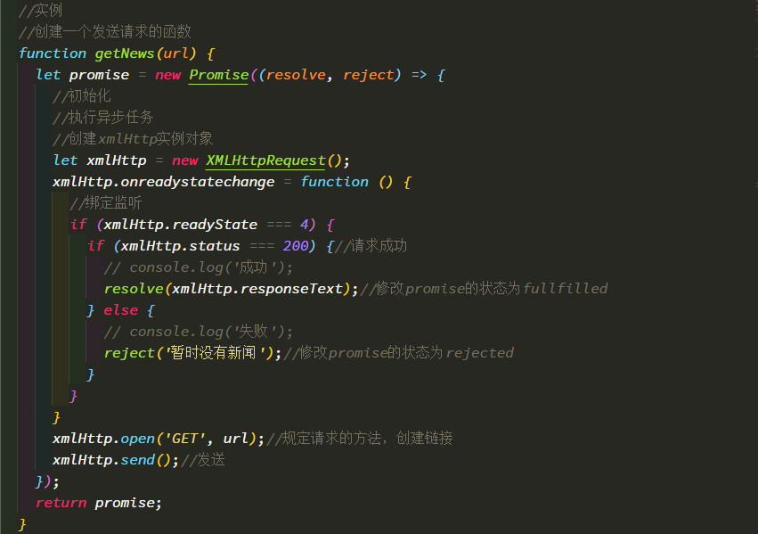

1. 理解:
  * Promise对象: 代表了未来某个将要发生的事件(通常是一个异步操作)
  * 有了promise对象, 可以将异步操作以同步的流程表达出来, 避免了层层嵌套的回调函数(俗称'回调地狱')
  * ES6的Promise是一个构造函数, 用来生成promise实例
2. 使用promise基本步骤(2步):
  * 创建promise对象
    ```
    let promise = new Promise((resolve, reject) => {
        //初始化promise状态为 pending
      //执行异步操作
      if(异步操作成功) {
        resolve(value);//修改promise的状态为fullfilled
      } else {
        reject(errMsg);//修改promise的状态为rejected
      }
    })
    ```
  * 调用promise的then()
    ```
    promise.then(function(
      result => console.log(result),
      errorMsg => alert(errorMsg)
    ))
    ```
3. promise对象的3个状态
  * pending: 初始化状态
  * fullfilled: 成功状态
  * rejected: 失败状态
4. 应用:
  * 使用promise实现超时处理

  * 使用promise封装处理ajax请求
    ```
    let request = new XMLHttpRequest();
    request.onreadystatechange = function () {
    }
    request.responseType = 'json';
    request.open("GET", url);
    request.send();
    ```
5. 基本应用
   
  
   结合ajax发送异步请求实例
   
   
   
  
  
  
    
    
    
    
    