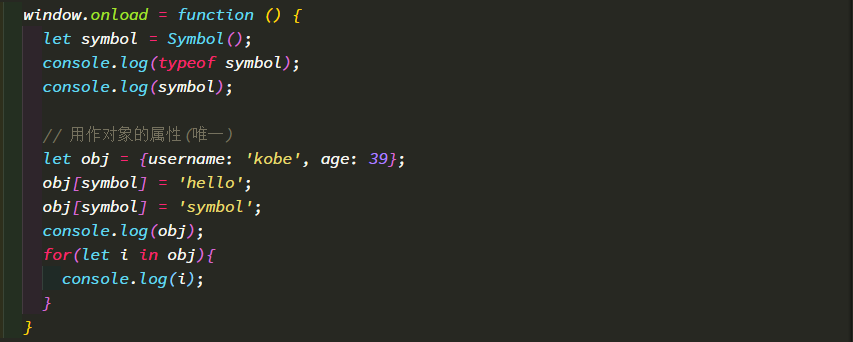

- 前言：ES5中对象的属性名都是字符串，容易造成重名，污染环境
- Symbol：
  - 概念：ES6中的添加了一种原始数据类型symbol(已有的原始数据类型：String, Number, boolean, 
  null, undefined, 对象)
  - 特点：
    1. Symbol属性对应的值是唯一的，解决命名冲突问题
    2. Symbol值不能与其他数据进行计算，包括同字符串拼串
    3. for in, for of遍历时不会遍历symbol属性。
  - 使用：
    1. 调用Symbol函数得到symbol值
      ```
      let symbol = Symbol();
      let obj = {};
      obj[symbol] = 'hello';
      ```
    2. 传参标识
      ```
      let symbol = Symbol('one');
      let symbol2 = Symbol('two');
      console.log(symbol);// Symbol('one')
      console.log(symbol2);// Symbol('two')
      ```
    3. 内置Symbol值
      * 除了定义自己使用的Symbol值以外，ES6还提供了11个内置的Symbol值，指向语言内部使用的方法。
      - Symbol.iterator
        * 对象的Symbol.iterator属性，指向该对象的默认遍历器方法(后边讲)

      
        
           