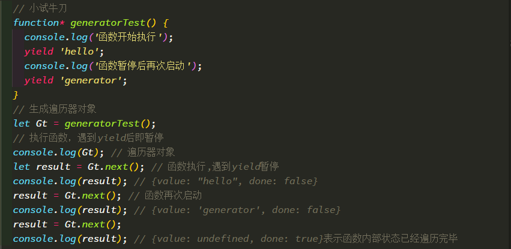
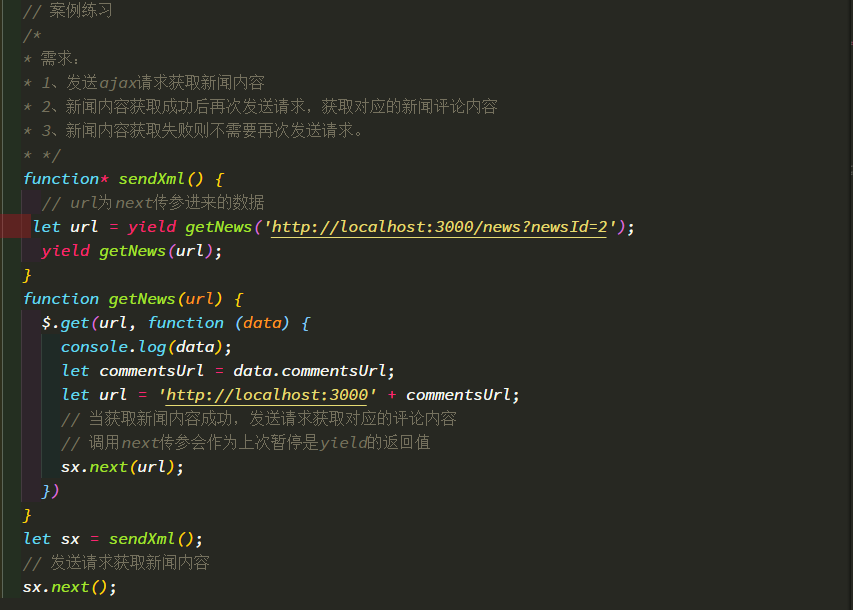

Generator函数
  - 概念：
    1. ES6提供的解决异步编程的方案之一
    2. Generator函数是一个状态机，内部封装了不同状态的数据，
    3. 用来生成遍历器对象
    4. 可暂停函数(惰性求值), yield可暂停，next方法可启动。每次返回的是yield后的表达式结果
  - 特点：
    1. function 与函数名之间有一个星号
    2. 内部用yield表达式来定义不同的状态
    例如：
    ```
    function* generatorExample(){
      let result = yield 'hello';  // 状态值为hello
      yield 'generator'; // 状态值为generator
    }
    ```
    3. generator函数返回的是指针对象(接11章节里iterator)，而不会执行函数内部逻辑
    4. 调用next方法函数内部逻辑开始执行，遇到yield表达式停止，返回{value: yield后的表达式结果/undefined, done: false/true}
    5. 再次调用next方法会从上一次停止时的yield处开始，直到最后
    6. yield语句返回结果通常为undefined， 当调用next方法时传参内容会作为启动时yield语句的返回值。

  
  
      
      