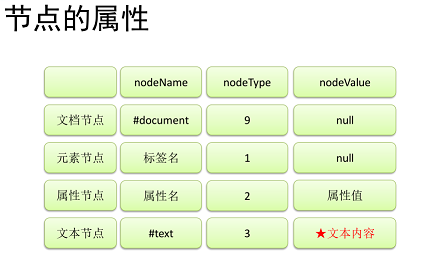

- DOM
	- Document Object Model
	- 文档对象模型，通过DOM可以来任意来修改网页中各个内容
	- 文档
		- 文档指的是网页，一个网页就是一个文档
	- 对象
		- 对象指将网页中的每一个节点都转换为对象
		  转换完对象以后，就可以以一种纯面向对象的形式来操作网页了
	- 模型
		- 模型用来表示节点和节点之间的关系，方便操作页面
	- 节点（Node）
		- 节点是构成网页的最基本的单元，网页中的每一个部分都可以称为是一个节点
		- 虽然都是节点，但是节点的类型却是不同的
		- 常用的节点
			- 文档节点 （Document），代表整个网页
			- 元素节点（Element），代表网页中的标签
			- 属性节点（Attribute），代表标签中的属性
			- 文本节点（Text），代表网页中的文本内容
	
			
- 文档的加载
	- 浏览器在加载一个页面时，是按照自上向下的顺序加载的，加载一行执行一行。
	- 如果将js代码编写到页面的上边，当代码执行时，页面中的DOM对象还没有加载，
	  此时将会无法正常获取到DOM对象，导致DOM操作失败。
	- 解决方式一：
		- 可以将js代码编写到body的下边
		```
		<body>
			<button id="btn">按钮</button>
			<script>
				var btn = document.getElementById("btn");
				btn.onclick = function(){
				
				};
			</script>
		</body>
		```
	- 解决方式二：
		- 将js代码编写到window.onload = function(){}中
		- window.onload 对应的回调函数会在整个页面加载完毕以后才执行，
		  所以可以确保代码执行时，DOM对象已经加载完毕了
		```
		<script>
			window.onload = function(){
				var btn = document.getElementById("btn");
				btn.onclick = function(){
				
				};
			};
		
		</script>	
		```
	
	
	

			

		

	
	
	
	
	
	
	
	
	
		
		
			
				
				