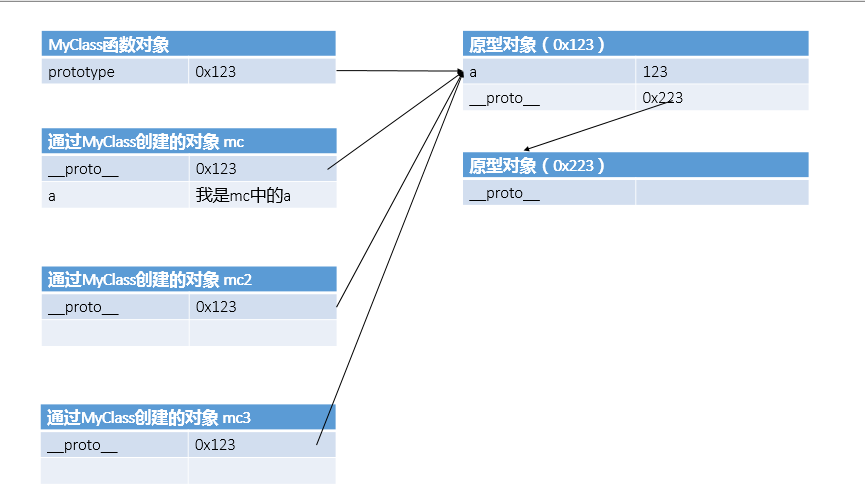

- 原型（prototype）
	- 创建一个函数以后，解析器都会默认在函数中添加一个数prototype，
		prototype属性指向的是一个对象，这个对象我们称为原型对象。
	- 当函数作为构造函数使用，它所创建的对象中都会有一个隐含的属性执行该原型对象。
		这个隐含的属性可以通过对象.__proto__来访问。

		
		mc.a会返回  自身的，mc2.a会返回原型中的a，（先从自身中找属性，然后找原型中的）
		
	- 原型对象就相当于一个公共的区域，凡是通过同一个构造函数创建的对象他们通常都可以访问到相同的原型对象。
		我们可以将对象中共有的属性和方法统一添加到原型对象中，
		这样我们只需要添加一次，就可以使所有的对象都可以使用。
	- 当我们去访问对象的一个属性或调用对象的一个方法时，它会先自身中寻找，
		如果在自身中找到了，则直接使用。
		如果没有找到，则去原型对象中寻找，如果找到了则使用，
		如果没有找到，则去原型的原型中寻找，依此类推。直到找到Object的原型为止，Object的原型的原型为null，
		如果依然没有找到则返a回undefined
	- hasOwnProperty()
		- 这个方法可以用来检查对象自身中是否含有某个属性
		- 语法：
			```
			对象.hasOwnProperty("属性名")
			与in对应
			属性名  in   对象
			使用in检查对象中是否含有某个属性时，如果对象中没有但是原型中有，也会返回true
			```
		
		
		

- 为什么要有原型这个概念，并且浏览器默认给每个函数都添加prototype这个属性？
	- 起因：创建一个Person构造函数
	- 在Person构造函数中，为每一个对象都添加了一个sayName方法，
		目前我们的方法是在构造函数内部创建的，
		也就是构造函数每执行一次就会创建一个新的sayName方法
		也是所有实例的sayName都是唯一的。
		这样就导致了构造函数执行一次就会创建一个新的方法，
		执行10000次就会创建10000个新的方法，而10000个方法都是一摸一样的
		这是完全没有必要，完全可以使所有的对象共享同一个方法
		```    			
		function Person(name , age , gender){
			this.name = name;
			this.age = age;
			this.gender = gender;
			//向对象中添加一个方法
			this.sayName = function(){
					alert("Hello大家好，我是:"+this.name);				
			}
		}
		```
			
	- 经过：
		```		
		function Person(name , age , gender){
			this.name = name;
			this.age = age;
			this.gender = gender;
			//向对象中添加一个方法
			this.sayName = fun;
		}
		//将公共的部分提取出来
			function fun(){
			alert("Hello大家好，我是:"+this.name);
		};
		```
			
	- 结果：		
			//将sayName方法在全局作用域中定义
			/*
			 * 将函数定义在全局作用域，污染了全局作用域的命名空间
			 * 	而且定义在全局作用域中也很不安全
			 */
		
			//向原型中添加sayName方法，不会污染全局空间，而且由Person构造函数实例化
			的对象，现在自己内部属性中找，找不到去原型中找
			Person.prototype.sayName = function(){
				alert("Hello大家好，我是:"+this.name);
			};
			
			//创建一个Person的实例
			var per = new Person("孙悟空",18,"男");
			var per2 = new Person("猪八戒",28,"男");
			per.sayName();
			per2.sayName();
			
			//console.log(per.sayName == per2.sayName);


		


		
			
			
			